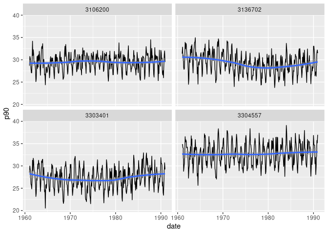

<!-- README.md is generated from README.Rmd. Please edit that file -->

# climindi

<!-- badges: start -->
<!-- badges: end -->

This package offers helper functions to compute climatological normals
and aggregated variables for several climate indicators in a
[tidy](https://www.tidyverse.org/) approach.

## Installation

You can install the development version of climindi from
[GitHub](https://github.com/) with:

``` r
# install.packages("pak")
pak::pak("rfsaldanha/climindi")
```

## Example

The package cames with dataset examples for seven different climate
indicators. Let’s use the maximum temperature indicator `temp_max_data`.

### Climatological normals

We can compute a climatological normal with the `summarise_normal()`
function.

``` r
library(dplyr)
#> 
#> Attaching package: 'dplyr'
#> The following objects are masked from 'package:stats':
#> 
#>     filter, lag
#> The following objects are masked from 'package:base':
#> 
#>     intersect, setdiff, setequal, union
library(climindi)

temp_max_normals <- temp_max_data |>
  # Identify year
  mutate(year = lubridate::year(date)) |>
  # Identify month
  mutate(month = lubridate::month(date)) |>
  # Group by id variable, year and month
  group_by(code_muni, year, month) |>
  summarise_normal(date_var = date, value_var = value, year_start = 1961, year_end = 1990) |>
  ungroup()
```

On this example, the function `summarise_normal()` will receive the
grouped data by municipality id, year and month, and compute the
climatological normal for those groups considering the values between
1961 and 1990

``` r
temp_max_normals
#> # A tibble: 1,440 × 4
#>    code_muni  year month normal
#>        <int> <dbl> <dbl>  <dbl>
#>  1   3106200  1961     1   25.9
#>  2   3106200  1961     2   28.2
#>  3   3106200  1961     3   28.3
#>  4   3106200  1961     4   28.1
#>  5   3106200  1961     5   25.5
#>  6   3106200  1961     6   24.8
#>  7   3106200  1961     7   25.2
#>  8   3106200  1961     8   27.8
#>  9   3106200  1961     9   31.8
#> 10   3106200  1961    10   28.4
#> # ℹ 1,430 more rows
```

### Indicators

With the summarize functions available at the package, it is possible to
compute several aggregated indicators, and some of them use the normals
computed above. Thus, supply the data using the same groups structures
of the normals.

``` r
indi_temp_max <- temp_max_data |>
 # Identify year
 dplyr::mutate(year = lubridate::year(date)) |>
 # Identify month
 dplyr::mutate(month = lubridate::month(date)) |>
 # Group by id variable, year and month
 dplyr::group_by(code_muni, year, month) |>
 # Compute maximum temperature indicators
 summarise_temp_max(value_var = value, normals_df = temp_max_normals) |>
 # Ungroup
 dplyr::ungroup()
```

``` r
indi_temp_max
#> # A tibble: 1,440 × 22
#>    code_muni  year month count normal  mean median    sd    se   max   min   p10
#>        <int> <dbl> <dbl> <int>  <dbl> <dbl>  <dbl> <dbl> <dbl> <dbl> <dbl> <dbl>
#>  1   3106200  1961     1    31   25.9  25.9   26.1  2.59 0.465  31.2  20.7  22.5
#>  2   3106200  1961     2    28   28.2  28.2   28.7  2.61 0.493  31.8  20.0  25.0
#>  3   3106200  1961     3    31   28.3  28.3   28.9  2.02 0.364  31.2  22.8  25.6
#>  4   3106200  1961     4    30   28.1  28.1   28.1  1.33 0.243  30.1  25.0  26.5
#>  5   3106200  1961     5    31   25.5  25.5   25.5  1.75 0.314  28.6  21.4  24.1
#>  6   3106200  1961     6    30   24.8  24.8   24.9  1.96 0.357  27.8  20.6  22.2
#>  7   3106200  1961     7    31   25.2  25.2   25.1  1.58 0.284  28.1  22.2  23.0
#>  8   3106200  1961     8    31   27.8  27.8   27.7  1.94 0.348  31.7  24.1  25.1
#>  9   3106200  1961     9    30   31.8  31.8   32.7  2.31 0.422  34.6  26.2  28.2
#> 10   3106200  1961    10    31   28.4  28.4   29.3  2.73 0.491  31.9  19.7  25.2
#> # ℹ 1,430 more rows
#> # ℹ 10 more variables: p25 <dbl>, p75 <dbl>, p90 <dbl>, heat_waves_3d <int>,
#> #   heat_waves_5d <int>, hot_days <int>, t_25 <int>, t_30 <int>, t_35 <int>,
#> #   t_40 <int>
```

The function `summarise_temp_max()` computes a total of 19 indicators.
Let’s plot one of them.

``` r
library(ggplot2)

indi_temp_max |>
  mutate(date = as.Date(paste0(year,"-",month,"-01"))) |>
  ggplot(aes(x = date, y = p90)) +
  geom_line(stat = "identity") +
  geom_smooth() +
  facet_wrap(~ code_muni)
#> `geom_smooth()` using method = 'loess' and formula = 'y ~ x'
```


